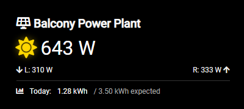

# MMM-APsystemsEZ1



A [MagicMirror²](https://magicmirror.builders/) module for local monitoring of your APsystems EZ1 microinverter (often used for balcony power plants).
This module uses the local API of the inverter, requires no cloud for your solar yield, and seamlessly integrates with [forecast.solar](https://forecast.solar/) for a beautiful daily yield forecast.

## Installation

Navigate to your MagicMirror `modules` directory and clone/copy this project.

## Configuration

Add the module to your `config/config.js` file under `modules`. Adjust the IP address and your geographic location!

```javascript
{
    module: "MMM-APsystemsEZ1",
    position: "top_right", // e.g. top_right, bottom_left etc.
    config: {
        inverterIp: "192.168.1.100", // The IP of your EZ1 inverter on your local network
        inverterPort: 8050, // Default port for APsystems EZ1 is 8050

        // Location settings for solar forecast
        lat: 0, // Latitude
        lon: 0, // Longitude
        declination: 30, // Tilt angle of the panels (0 = flat, 90 = vertical)
        azimuth: 0, // Direction (0 = South, -90 = East, 90 = West)
        kwp: 0.8, // Watt-Peak power in kW (e.g. 0.8 for 800 Wp)

        // Display Options
        showIndividualPanels: true, // Show separated L/R panel power (true/false)
        language: "en", // Set to "de" for German, "en" for English
        
        // Update Intervals
        updateInterval: 30000, // Fetch local API every 30 seconds
        forecastInterval: 3600000, // Fetch forecast API once per hour
    }
}
```

## API Limits
Please do not set the `forecastInterval` below 1 hour (3600000 ms). The free tier of the `forecast.solar` API implements strict rate limits and will temporarily block your IP if polled too frequently. Since the solar path doesn't change by the minute, once an hour is perfectly fine.

## Requirements
The inverter must be connected to the exact same local Wi-Fi network as your MagicMirror device.
The local API must be enabled on the inverter. This can usually be done once via the official APsystems smartphone app (Connect via Bluetooth -> Settings -> Enable Local Network API).
